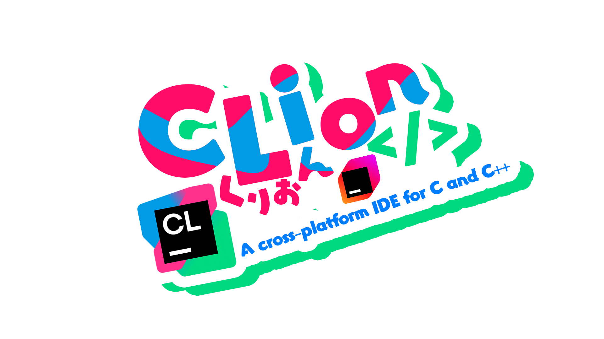
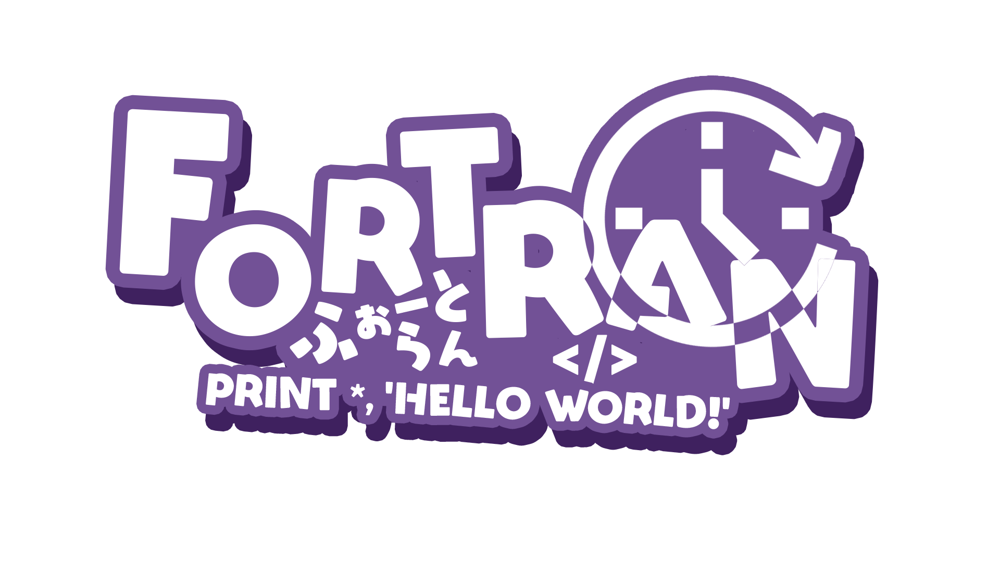
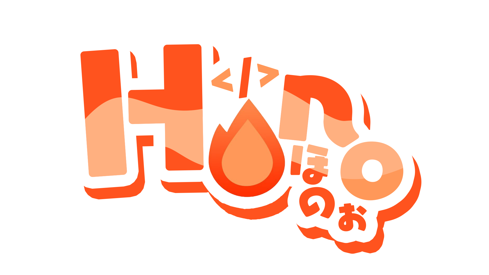
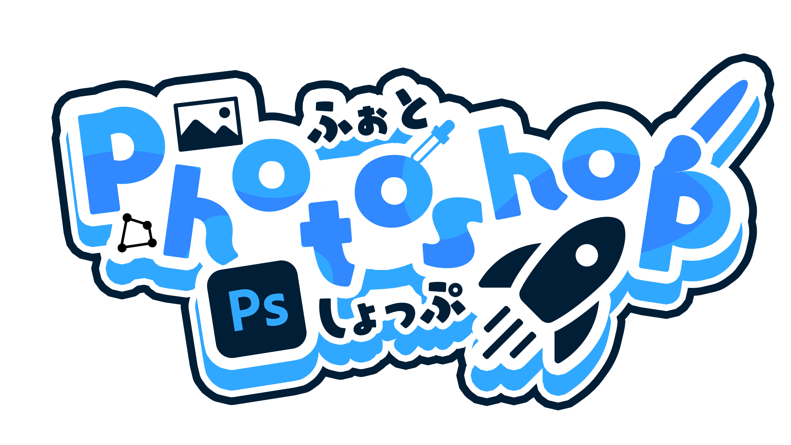
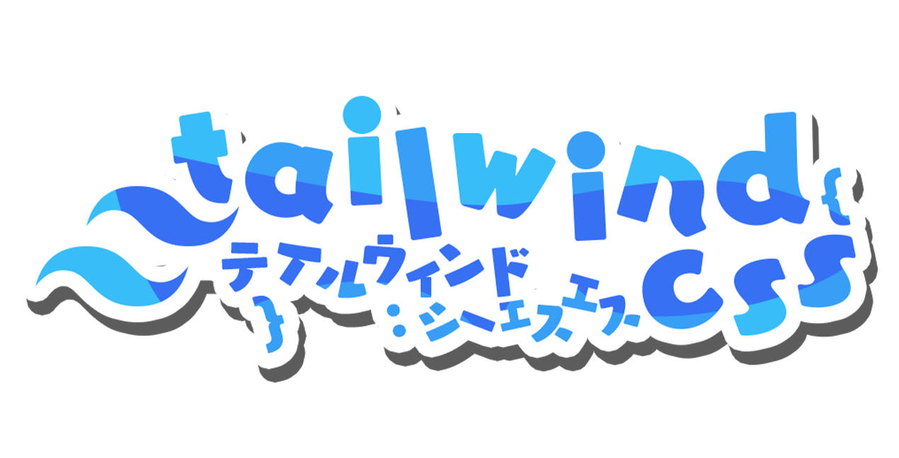
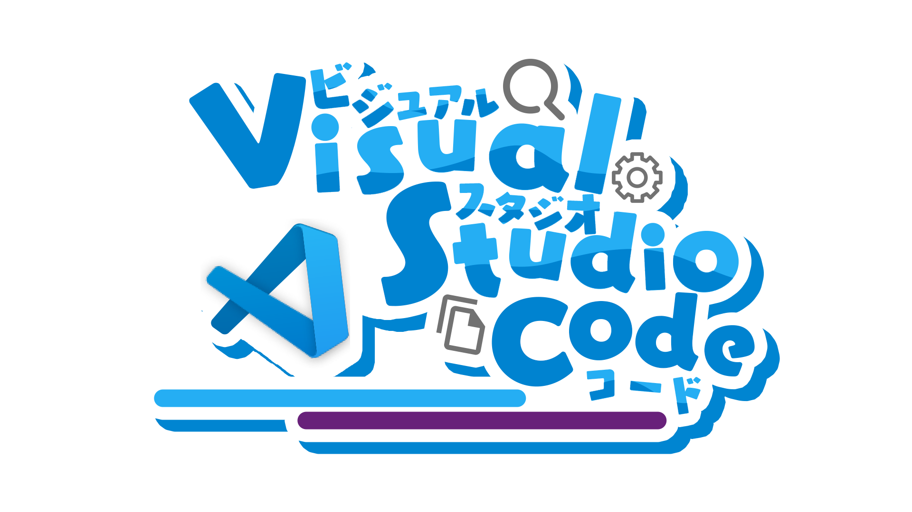

<!-- markdownlint-disable MD026 MD033 MD041 -->

[English README](README.md) | [日本語 README](README-ja.md) | [简体中文 README](README-zhHans.md) | [繁體中文 README](README-zhHant.md) | [Español README](README-es.md) | [README Français](README-fr.md) | [Hindi README](README-hi.md)

# ServiceLogos

Shubh prabhaat,
Is repository me alag alag services ke liye Sawaratsuki dwara daale gaye logo hai.

> [!WARNING]
> Ye logos official nahi hai.

> [!Important]
> Kisi bhi halat me in logos ka AI learning ke liye use karna mana hai.

# License

## Agar logo use karna hai to aage dhyaan se padhe.

> [!NOTE]
>
> ### Saaransh:
>
> - In logos ka istemaal aap aise kar sakte hai jisse apko koi laabh ya paisa na mile.
>   Jaise ki stickers ke roop mein print karke ya editors ke icons ke roop mein, aap inka istemal kar sakte hain.
> - Credits dena bilkul zaroori hai!
>   Aap ise modify ya remix kar sakte hai, lekin aapko us naye logo ko original logo ke saath ek hi license ke antargat license karna hoga.
> - Agar aap is logo ka istemal karke kuch banate hai, toh jab post karte hai tab [Sawaratsuki](https://x.com/sawaratsuki1004) ko mention karna motivation dega!

### Sab items

**CC BY-NC-SA 4.0 license ## Commit[c2cf292] ke baad nahi diye gaye hai**  
**## Commit[c2cf292] ke baad yah niyam lagu honge**

1. In logo ko SAWATSUKI ne banaya hai. Copyright puri tarah se hataya nahi gaya hai.
2. In baato ka dhyaan rakhe
   > - Puri tarah se credit dena acha rahega , isse utsah badhta hai.
   > - Aap in logos ko remix ya badal sakte hai.
   > - In logos se kisi bhi tarah se paisa kamana mana hai ( Jaise ki in logos ko use karke saman bechna). Magar aap in logos ko kuch conditions me bech sakte hai.
   >
   > 1. "Jab us service ka official product ko commercial purposes ke liye bechna chahta hai."
   > 2. Jab Sawaratsuki aapko agya de
   >    (Agar aapko koi iska palan nahi karte hue milta hai to [@Sawaratsuki](https://x.com/sawaratsuki1004) se turant sampark kare)
3. Logos ko sticker banake personal use karne pe koi manahi nahi hai.

# Koi aisa logo chahiye jo yaha nahi hai ?

Aap is repo ke issues me bata dijiye , confirm karne ke baad ham bana denge.
Har kisi ke schedules ke anusaar, hum turant jawaab nahi de sakte. Kuch dino tak bhi lag sakta hai.

> [!IMPORTANT]  
> Jab issue post kar rahe ho to request tag lagana na bhule

# Services ke officials ke liye

[SAWATSUKI](https://x.com/sawaratsuki1004) ko ek message bhejiye,
Ham usse turant hata denge.
Agar aapko apne products bechne hai to uske liye bhi [SAWATSUKI](https://x.com/sawaratsuki1004) ko ek message bhej dijiye.

# Designing ke liye istemal kiye gaye tools

- Photoshop / Illustrator
- Font [Eureka Font]
- Sawaratsuki ka utsah
- Aapke vichar ke tweets (Bohot dhanyavaad!)

# Acknowledgments

Ye logos naye creations hain.  
Har officer ke dwaara istemal kiye gaye logos se behtar kuch nahi hai.  
Hum is publication mein seva karne waalon ke prati apni gehri shukriya vyakt karna chaahenge.

## Logos ka list

<!-- image-list: start -->

| Name | Image |
| --- | --- |
| [403Forbidden](/images/403Forbidden) |  |
| [404Notfound](/images/404Notfound) |  |
| [418I'mateapot](/images/418I%27mateapot) |  |
| [503ServiceUnavailable\.png](/images/503ServiceUnavailable.png) |  |
| [Angular](/images/Angular) |   |
| [ArchLinux](/images/ArchLinux) |  |
| [C](/images/C) |  |
| [C\#](/images/C%23) |   |
| [C\+\+](/images/C%2B%2B) |  |
| [C,C\#,C\+\+](/images/C%2CC%23%2CC%2B%2B) |  |
| [Clion](/images/Clion) |  |
| [Cloudflare](/images/Cloudflare) |  |
| [Cobol](/images/Cobol) |  |
| [Crowdstrike](/images/Crowdstrike) |  |
| [Discord](/images/Discord) |  |
| [Figma](/images/Figma) |  |
| [FlipperZero](/images/FlipperZero) |  |
| [Flutter](/images/Flutter) |  |
| [FORTRAN](/images/FORTRAN) |  |
| [GitHub](/images/GitHub) |  |
| [GitLab](/images/GitLab) |  |
| [Gnuemacs](/images/Gnuemacs) |  |
| [Go](/images/Go) |  |
| [Haskell](/images/Haskell) |   |
| [Hono](/images/Hono) |  |
| [Html](/images/Html) |  |
| [Htmx](/images/Htmx) |  |
| [IamSeries](/images/IamSeries) |     |
| [Java](/images/Java) |  |
| [Julia](/images/Julia) |  |
| [Juniper](/images/Juniper) |  |
| [Kernel Panic](/images/Kernel%20Panic) |  |
| [Kotlin](/images/Kotlin) |   |
| [Laravel](/images/Laravel) |  |
| [MS\-DOS](/images/MS-DOS) |  |
| [Mui](/images/Mui) |  |
| [Next\.js](/images/Next.js) |  |
| [Node\.js](/images/Node.js) |  |
| [Photoshop](/images/Photoshop) |  |
| [Python](/images/Python) |  |
| [Qwik\.js](/images/Qwik.js) |  |
| [RaspberryPi](/images/RaspberryPi) |  |
| [React](/images/React) |  |
| [RhineLab](/images/RhineLab) |  |
| [Rider](/images/Rider) |  |
| [Rstudio](/images/Rstudio) |  |
| [Ruby](/images/Ruby) |  |
| [Rust](/images/Rust) |  |
| [Streamloots](/images/Streamloots) |  |
| [Swift](/images/Swift) |  |
| [Tailwindcss](/images/Tailwindcss) |  |
| [Teamspeak](/images/Teamspeak) |  |
| [Twitter](/images/Twitter) |  |
| [TypeScript](/images/TypeScript) |  |
| [Ubuntu](/images/Ubuntu) |  |
| [UnityBlender](/images/UnityBlender) |  |
| [Vim](/images/Vim) |  |
| [VisualStudioCode](/images/VisualStudioCode) |   |
| [Vite](/images/Vite) |  |
| [Voicemod](/images/Voicemod) |  |
| [Vrchat](/images/Vrchat) |  |
| [Vue](/images/Vue) |  |
| [Wallhack](/images/Wallhack) |  |
| [X](/images/X) |  |

<!-- image-list: end -->

Agar kisi bhasa ka README me taal mel hai , to Japanese README ko sabse sahi mana jayega.
