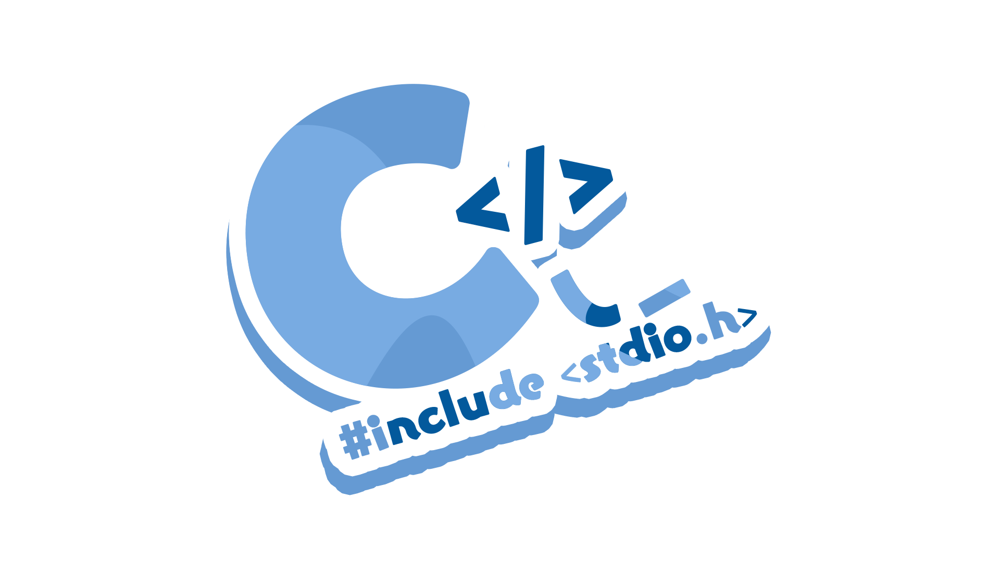
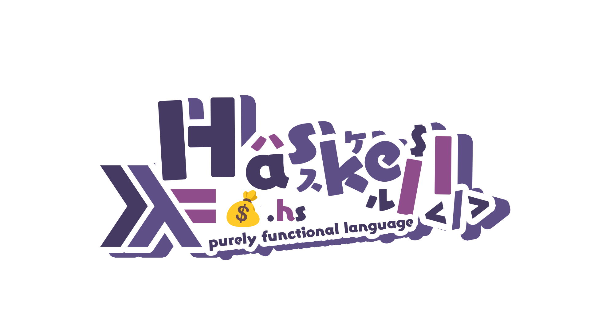
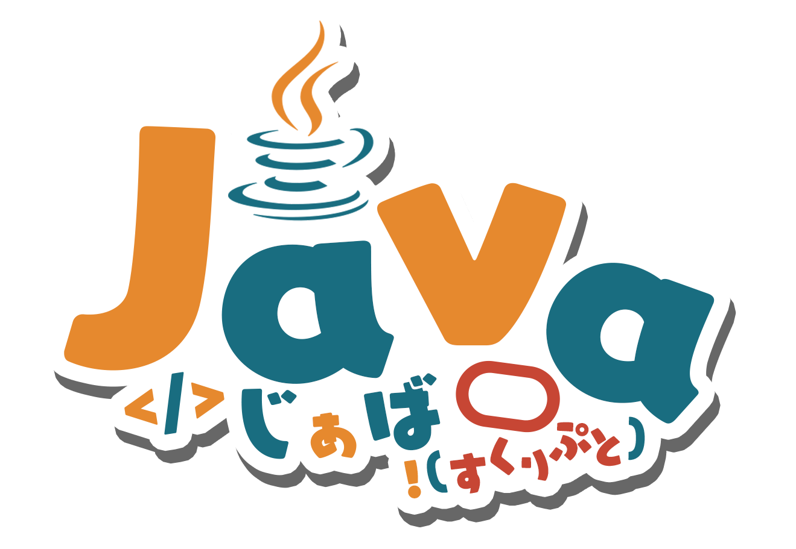
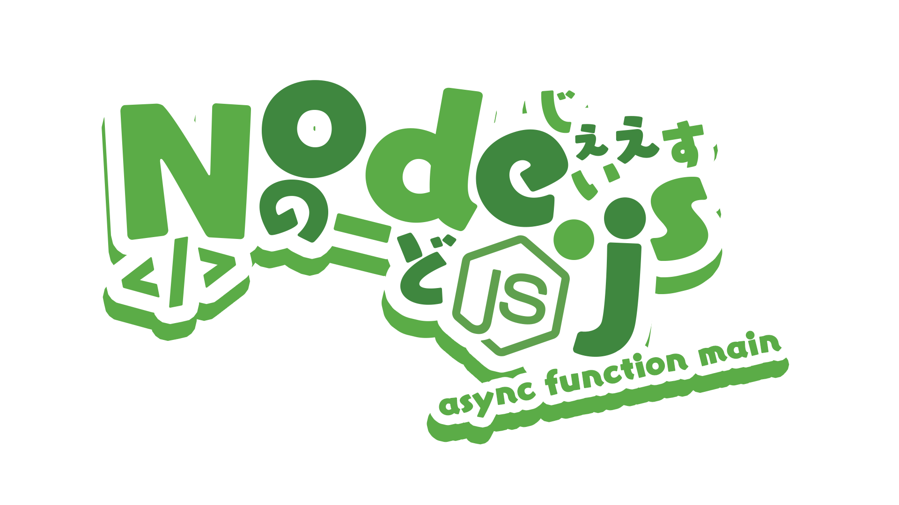
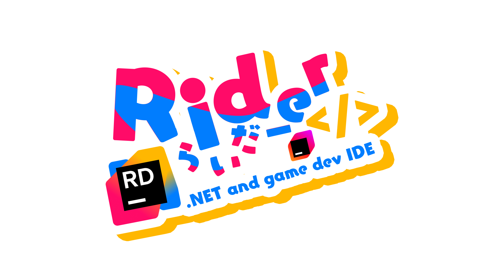
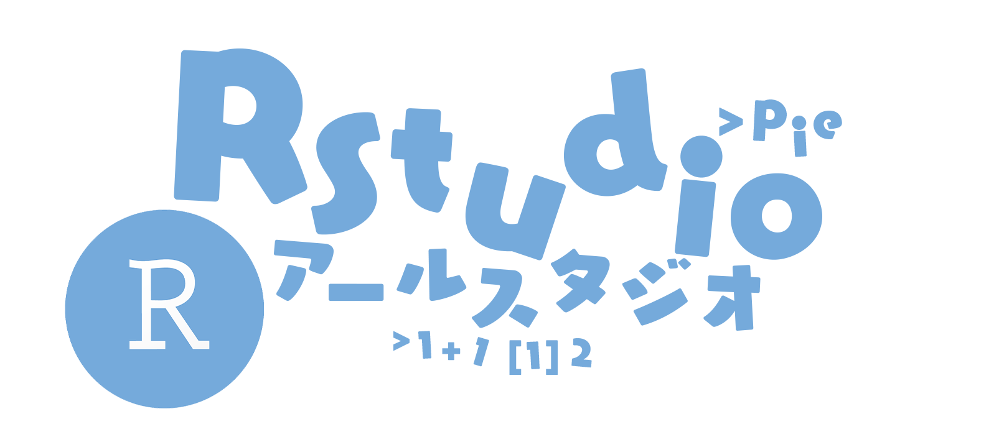
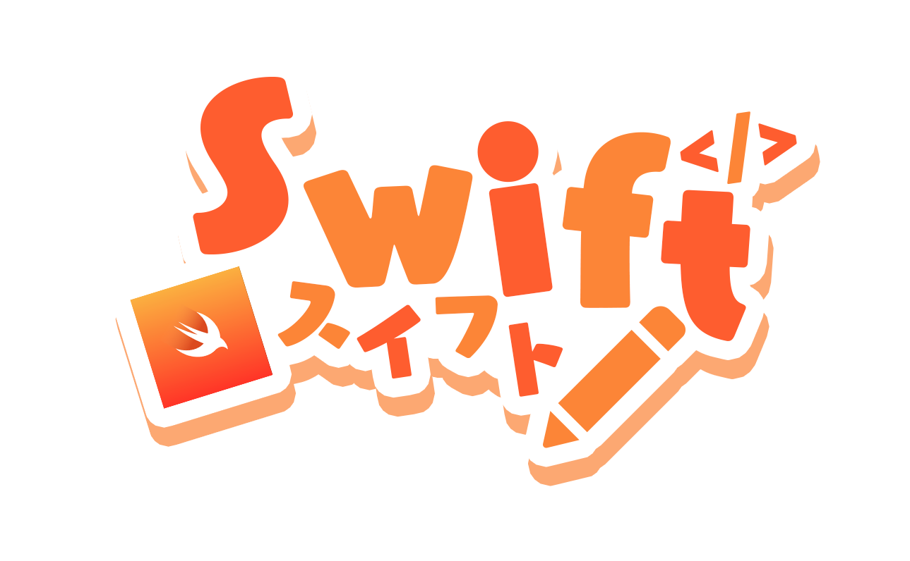
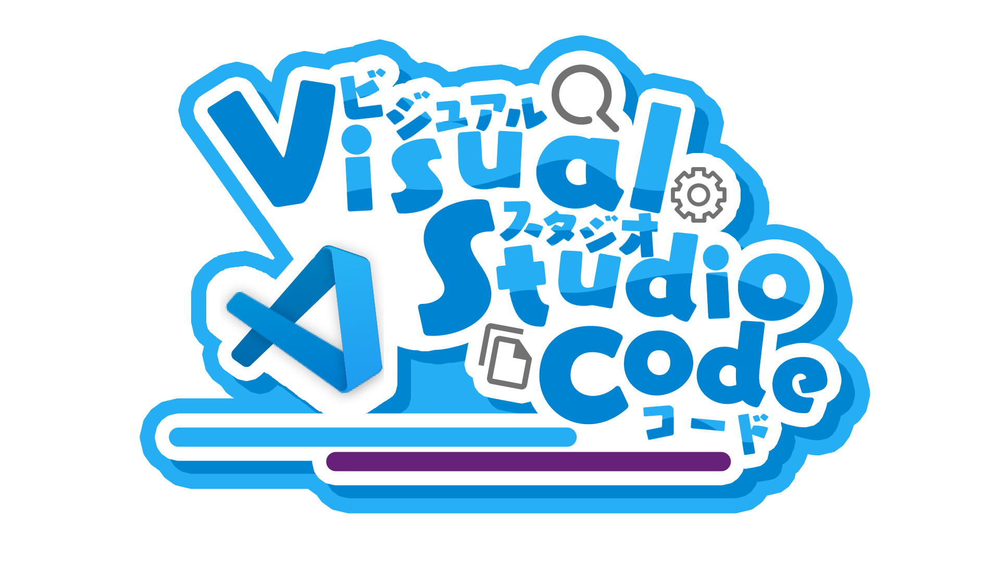
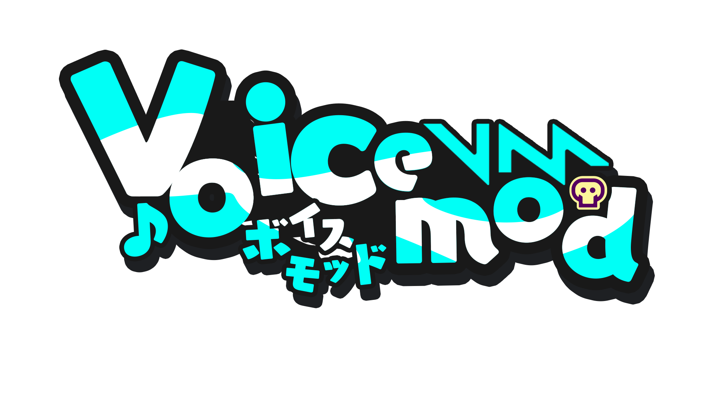

<!-- markdownlint-disable MD026 MD033 MD041 -->

[English README](README.md) | [日本語 README](README-ja.md) | [简体中文 README](README-zhHans.md) | [繁體中文 README](README-zhHant.md) | [Español README](README-es.md) | [README Français](README-fr.md)

# ServiceLogos

こんにちは、こんばんは
ここはさわらつきが作った各サービスのロゴをアップロードするリポジトリです。

> [!WARNING]
> ここにあるロゴは公式のロゴではありません。

> [!Important]
> いかなる場合においても、ロゴをAI学習に使用することは認めません。

# ライセンス

## ロゴを使用したい場合、このセクションを必ずお読みください

> [!NOTE]
>
> ### 要約:
>
> - 営利目的でない、非営利目的である場合このロゴを自由に使用することが出来ます。
>   例えば、シールやステッカーとして印刷することやエディタのアイコンなどに使用できます。
> - クレジットを明記してほしいです！
>   改変やリミックスは自由ですが、その新しい作品にもこの元のロゴと同じライセンスを付けてください。
> - このロゴを使用してなにか作った場合は[さわらつきをメンション](https://x.com/sawaratsuki1004)してポストしてくれるとモチベーションに繋がります！

### 全項

**Commit[c2cf292]以降のロゴについてはCC BY-NC-SA 4.0のライセンスが付与されません。**  
**Commit[c2cf292]以降のロゴは以下の規約が適用されます。**

1. これらのロゴの作成者は さわらつき です。 著作権を完全に放棄したわけではありません。
2. 以下の項目を確認してください。
   > - クレジットを明記することが推奨されます。モチベーションに繋がりますので、ぜひお願いします。
   > - 改変、リミックスすることが可能です。
   > - 営利目的（ロゴを使用した商品の販売等）での使用は禁止です。ただし以下に定める項目に該当する場合は販売することが出来ます。
   >   1. 各サービスの公式が営利目的で販売したい場合
   >   2. さわらつきが許可した場合  
   >      (違反を見つけた場合はすぐに[@さわらつき](https://x.com/sawaratsuki1004)にご連絡ください！)
3. ステッカーやシールなどを個人使用の範囲で許可なく使用しても問題ありません！

# ここにないロゴが欲しい！

issuesに投稿してください。確認次第作成します。
個人のスケジュールにより対応できない場合もあります。数日かかる場合もあります。

> [!IMPORTANT]  
> issuesに投稿する場合必ずリクエストタグを付けて投稿してください

# 各サービスの公式の方へ

ロゴの削除を申請する場合は[さわらつきのダイレクトメッセージ](https://x.com/sawaratsuki1004)までお問い合わせください
すぐに削除いたします
公式で販売したい場合も同様に[さわらつきのダイレクトメッセージ](https://x.com/sawaratsuki1004)までお問い合わせください

# デザインを作るに当たって使用しているもの

- Photoshop / Illustrator
- Font [ユールカフォント]
- さわらつきのモチベーションと気持ち
- 皆様の感想ポスト

# 謝辞

これらのロゴは二次創作です。  
各公式が使用しているロゴに勝るものはありません。  
ここで公開したサービスの方たちに深く感謝いたします。

# 画像一覧

<!-- image-list: start -->

| 名前 | 画像 |
| --- | --- |
| [403Forbidden](/images/403Forbidden) |  |
| [404Notfound](/images/404Notfound) |  |
| [418I'mateapot](/images/418I%27mateapot) |  |
| [503ServiceUnavailable\.png](/images/503ServiceUnavailable.png) |  |
| [Angular](/images/Angular) |   |
| [ArchLinux](/images/ArchLinux) |  |
| [C](/images/C) |  |
| [C\#](/images/C%23) |   |
| [C\+\+](/images/C%2B%2B) |  |
| [C,C\#,C\+\+](/images/C%2CC%23%2CC%2B%2B) |  |
| [Clion](/images/Clion) |  |
| [Cloudflare](/images/Cloudflare) |  |
| [Cobol](/images/Cobol) |  |
| [Crowdstrike](/images/Crowdstrike) |  |
| [Discord](/images/Discord) |  |
| [Figma](/images/Figma) |  |
| [FlipperZero](/images/FlipperZero) |  |
| [Flutter](/images/Flutter) |  |
| [FORTRAN](/images/FORTRAN) |  |
| [GitHub](/images/GitHub) |  |
| [GitLab](/images/GitLab) |  |
| [Gnuemacs](/images/Gnuemacs) |  |
| [Go](/images/Go) |  |
| [Haskell](/images/Haskell) |   |
| [Hono](/images/Hono) |  |
| [Html](/images/Html) |  |
| [Htmx](/images/Htmx) |  |
| [IamSeries](/images/IamSeries) |     |
| [Java](/images/Java) |  |
| [Julia](/images/Julia) |  |
| [Juniper](/images/Juniper) |  |
| [Kernel Panic](/images/Kernel%20Panic) |  |
| [Kotlin](/images/Kotlin) |   |
| [Laravel](/images/Laravel) |  |
| [MS\-DOS](/images/MS-DOS) |  |
| [Mui](/images/Mui) |  |
| [Next\.js](/images/Next.js) |  |
| [Node\.js](/images/Node.js) |  |
| [Photoshop](/images/Photoshop) |  |
| [Python](/images/Python) |  |
| [Qwik\.js](/images/Qwik.js) |  |
| [RaspberryPi](/images/RaspberryPi) |  |
| [React](/images/React) |  |
| [RhineLab](/images/RhineLab) |  |
| [Rider](/images/Rider) |  |
| [Rstudio](/images/Rstudio) |  |
| [Ruby](/images/Ruby) |  |
| [Rust](/images/Rust) |  |
| [Streamloots](/images/Streamloots) |  |
| [Swift](/images/Swift) |  |
| [Tailwindcss](/images/Tailwindcss) |  |
| [Teamspeak](/images/Teamspeak) |  |
| [Twitter](/images/Twitter) |  |
| [TypeScript](/images/TypeScript) |  |
| [Ubuntu](/images/Ubuntu) |  |
| [UnityBlender](/images/UnityBlender) |  |
| [Vim](/images/Vim) |  |
| [VisualStudioCode](/images/VisualStudioCode) |   |
| [Vite](/images/Vite) |  |
| [Voicemod](/images/Voicemod) |  |
| [Vrchat](/images/Vrchat) |  |
| [Vue](/images/Vue) |  |
| [Wallhack](/images/Wallhack) |  |
| [X](/images/X) |  |

<!-- image-list: end -->

各言語のREADMEで不整合があった場合は、日本語のREADMEを優先します。
